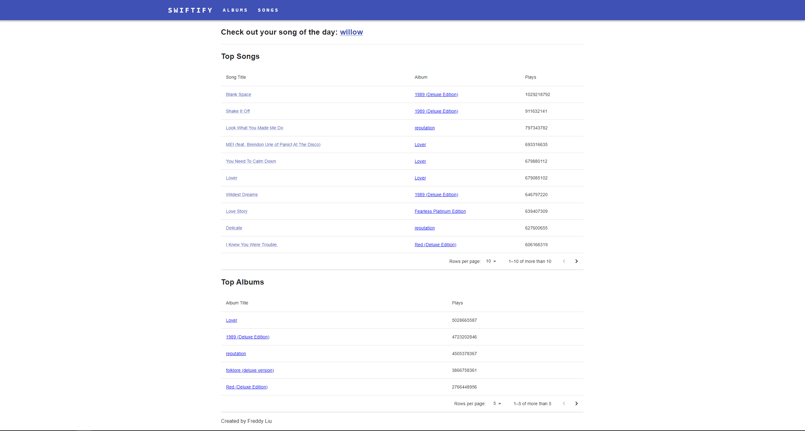
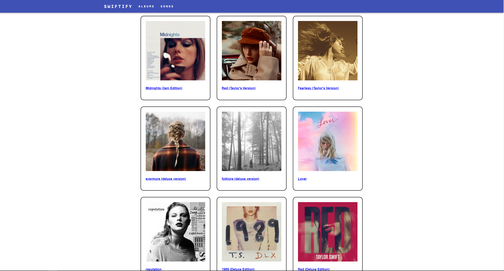
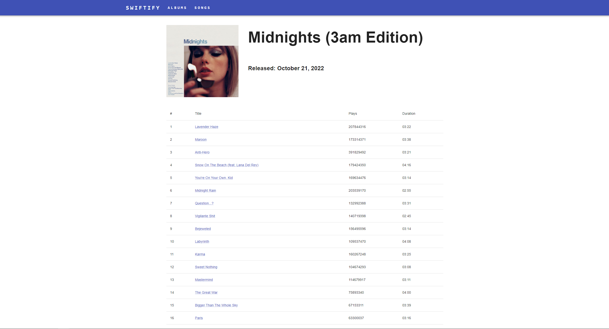
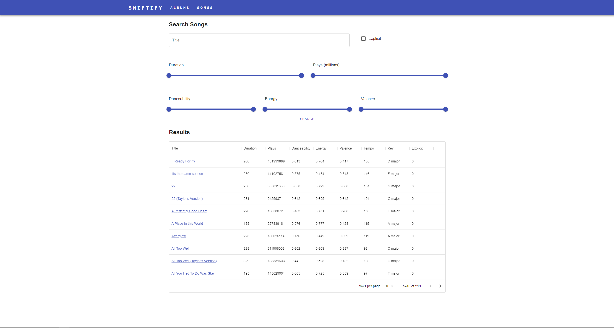
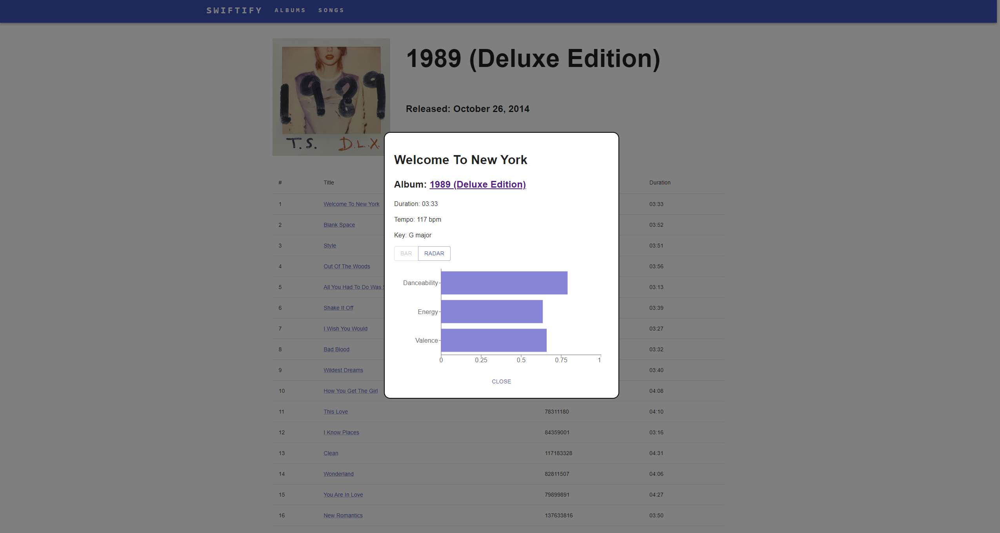

# Swiftify App
Interactive Spotify-themed web application using React, NodeJS and MySQL RDS database

Application can be run as follows:

- cd to `spotifyApp/client`
- `npm install`
- `npm run start`
- In another terminal, cd to `spotifyApp/server`
- `npm install`
- `npm run start`

## File structure

`client` folder contains the files for the frontend. This was developed using React.

`server` folder contains the files for the backend routes and methods. This was developed in NodeJS.

`data` folder contains the data that was used for the project. The data was obtained from Spotify, specifically a selection of Taylor Swift's albums and songs. The data was hosted on an AWS RDS instance. The database connection information can be found and modified in the `spotifyApp/server/config.json` file.

## Pages

Homepage that displays a random song of the day, top songs and top albums ordered by number of plays:

Albums page that displays all of the albums in the database:

An example of a page when we click into a single album:

Songs page that allows user to search for songs within the given range of inputs.

An example of a song card that displays information of a song when a song is clicked

